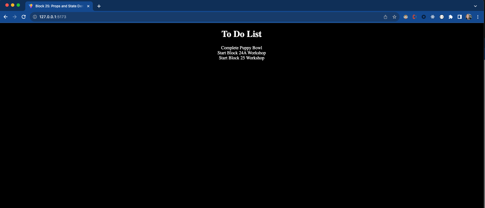
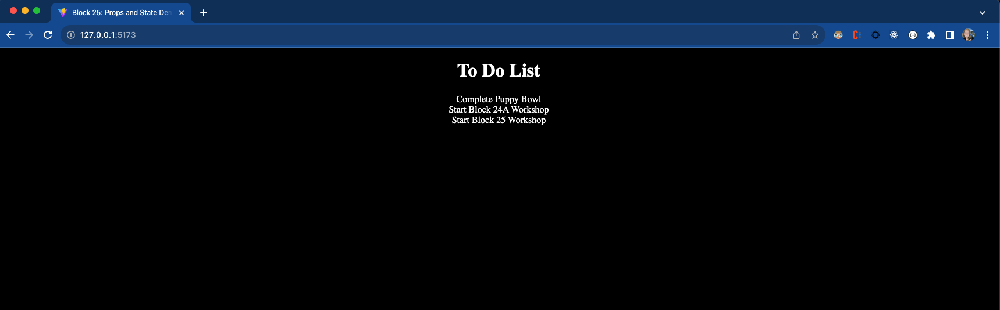
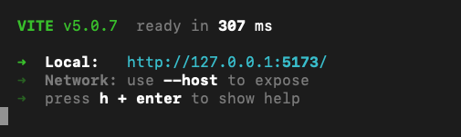

# Block 25: Props and State

Guided in-class project for Block 25. 

In this project we will learn about React props and state. 

## Introduction
Now that we have learned about React we are going to create a simple To Do Task List.  

The application should look like the following when we are done: 




 

## Steps to complete the project
1. Using your command line, navigate into the project folder
2. Run `npm create vite@latest` in your command line to create a react application 
    * The command will run through a series of prompts. Answer with the following: 
        - ? Project name: block25_demo
        - ? Select a framework: React
        - ? Select a variant: JavaScript
3. `cd` into the `block25_demo` folder and run `npm i` in your command line to install the necessary files 
4. Remove the following from the newly created React project
    * README file
    * /src/assets folder
    * /src/index.css file
5. Update the following files:
    * /src/main.jsx
        - line 4: remove un-needed import
    * /src/App.jsx 
        - lines 10-32: remove and add an empty div element
        - lines 2-3: remove un-needed imports
        - line 5: remove un-need count state
    * src/App.css 
        - remove all lines from CSS file
        - add CSS to be in dark mode by default
    * .eslintrc.cjs
        - lines 5-6: remove extends default lint to remove propType linting errors  
    * index.html
        - line 7: update title to `Block 25: Props and State Demo`
6. Run `npm run dev` in your command line to start the React Application. You should see the following in your terminal: 

7. Copy the url under the Local and paste it in your browser
8. Navigate to the App.jsx file and create a state for our tasks using the following as our default state:
```js
[
    {
        task: 'Complete Puppy Bowl',
        id: 1,
        completed: false
    },
    {
        task: 'Start Block 24A Workshop',
        id: 2,
        completed: false
    },
    {
        task: 'Start Block 25 Workshop',
        id: 3,
        completed: false
    }, 
]
```
9. Add a title to our component 
10. Create a TaskList component above the App component 
    * This component should take tasks as props
    * It should map over the tasks and render each task 
    * Add a class name to the component of `complete` if the task's completed key is true
11. Render the TaskList component inside the App component (underneath the title)
    * Pass the `tasks` we have in state to the component
    * Pass the `setTasks` state change handler to the component 
12. Create a `completeTask` function within the TaskList component before the return 
    * This function will take a `taskId`
    * Map through the `tasks` list and if the task `id` is a match to the `taskId` passed we change the `completed` key to the opposite of what is currently set
    * Pass this updated task list to the `setTasks` change handler
13. Add an `onclick` property to each task `div` which will call the `completeTask` function 
14. In our App.css add style to cross out the text when the class `complete` is present
