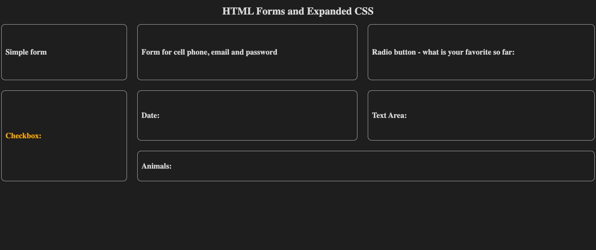
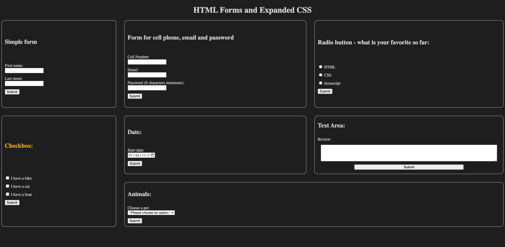

# Expanded CSS and HTML

Demo Project for Block 10: Expanded CSS and HTML

In this project we will learn about HTML forms and the different kinds of inputs and advanced CSS such as flexbox and grid containers. 

Our website currently looks like:

When we are complete our website should look like:

## Instructions to run this project

- Using your command line, navigate into the project folder
- Use the Live Server extension to run the html file

## Steps to complete the project
Search for "👉 STEP " within the `index.html` file to find where each step is located.

1. Add a form tag in each section
2. Add an action to each form so that when the form is submitted it navigates to the `submission.html` file
3. Add a submit input type to each form and give it a class of submit_btn

`Simple Form`

4. Add labels and text inputs in order to capture a First name and a Last name

`Form for cell phone, email and password`

5. Add labels  to capture the Cell Number, Email and Password (8 characters minimum)
6. Add an email input, password input and number input to 

`Radio button - what is your favorite so far:`

7. Add labels and radio inputs to capture a favorite programming language 
8. Add a value attribute for each radio input

`Checkbox:`

9. Add labels and checkbox inputs to capture a vehicle
10. Add a value attribute for each checkbox input

`Date:`

11. Add a label and date input to capture the start date
12. Add the attributes value, min and max to the date input

`Text Area:`

13. Add a label and textarea input to capture a Review
14. Add a class of flex_input to the textarea input
15. Add the attributes rows and cols to the textarea input

`Animals:`

16. Add a label and select input type to pick a pet