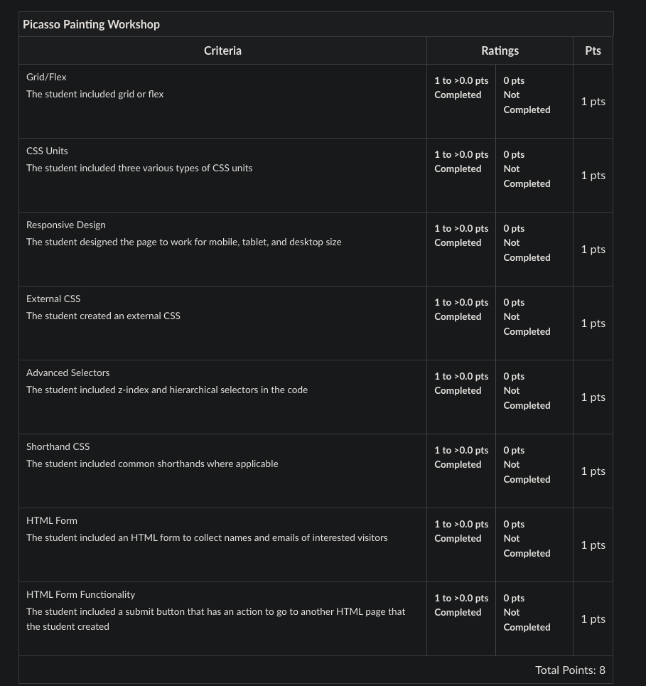

# Block 10: Expanded HTML and CSS - Workshop Picasso Painting 

A local art gallery is looking for curated digital forms of abstract art using CSS. You have mastered the art of z-index, flex, grid, and many more advanced CSS techniques, so you decide to create a piece for the gallery.

Below your artwork, include a form for visitors to input their name and email if they are interested in purchasing a digital copy of your work. 

## Requirements
* Use grid or flex.
* Use three various types of CSS units.
* Make sure it works on all screen sizes. Some people will not be able to attend the gallery but they have a virtual gallery room.
    - Desktop: 1680 x 1050
    - iPad: 1024 x 768
    - Mobile: 480 x 320
* You must use z-index and hierarchical selectors in the code.
* Use common shorthands where applicable.
* Add an HTML form to collect the names and emails of interested visitors. 
    - It should have a submit button and the form's action will take the user to another HTML page.
    - Note: the form does not actually need to collect information! You can direct the user to another HTML page by assigning a value to the <form>'s action attribute.

## Rubric
