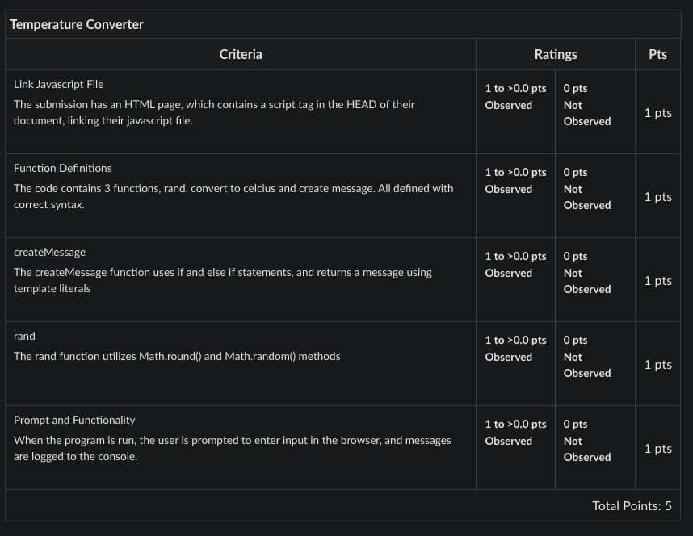

# Block 13: Workshop

In this workshop, you will create an application to convert Fahrenheit to Celsius. It will utilize the same concepts from your guided practice, which you can use as a reference. This page will prompt the user to enter a number, and we will convert it from Fahrenheit to Celsius and let the user know if the temperature is hot or cold.

## Rubric 
