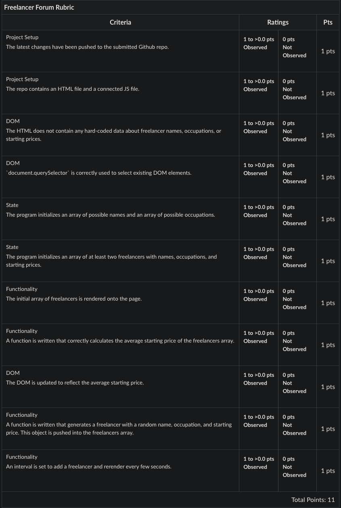

# Block 19: Workshop

In this workshop, you will create a platform where independent freelancers can advertise their services. 

## Requirements
Build your website according to this user story:
> A visitor enters the website and finds a list of available freelancers. Each freelancer has a name, an occupation, 
> and a starting price for their services. They observe on the list Alice, the writer with a starting price of $30, and
> Bob, who is a teacher, has a starting price of $50.
>
>The visitor also finds a message that displays the average starting price of all the freelancers. In this example, 
> the average starting price is $40.
> 
>A few seconds later, a new listing appears for a freelancer named Carol, who is a programmer and has a starting 
>price of $70. The average starting price is updated to $50.
>
>New freelancers continue to appear every few seconds, and the average starting price is updated accordingly

## Getting Started
There is no starter code for this workshop. However, the solution is very similar to the Shapes guided practice. You are encouraged to use that repository as a starting point for this workshop.

1. Create a new repository named Unit2.FreelancerForum on GitHub and clone it down.
2. Add your cohort team to the repository you just made.
3. Open the project with VS Code and create an HTML file and a JavaScript file.
4. Figure out a plan for what code you will need to write based on the user story. Use the rubric to guide you.

## Hints
Example freelancers array:
```js
const freelancers = [
  { name: "Dr. Slice", price: 25, occupation: "gardener" },
  { name: "Dr. Pressure", price: 51, occupation: "programmer" },
  { name: "Prof. Possibility", price: 43, occupation: "teacher" },
  { name: "Prof. Prism", price: 81, occupation: "teacher" },
  { name: "Dr. Impulse", price: 43, occupation: "teacher" },
  { name: "Prof. Spark", price: 76, occupation: "programmer" },
  { name: "Dr. Wire", price: 47, occupation: "teacher" },
  { name: "Prof. Goose", price: 72, occupation: "driver" },
];
```

## Rubric
